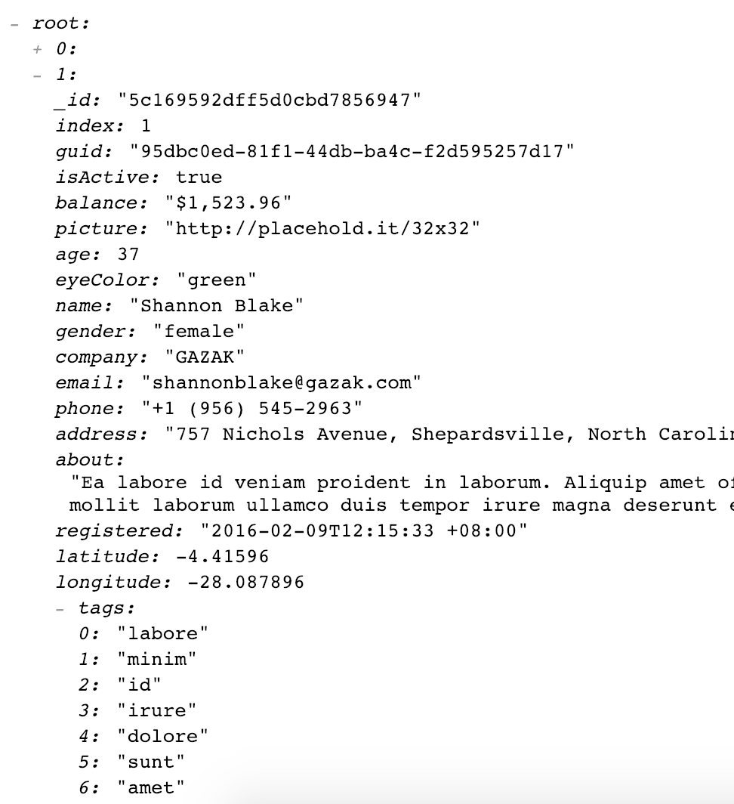

# lazy-object-view
lazy-object-view is a simple JS object tree visualizer/explorer that adheres to "what you see is what's in the DOM". lazy-object-view is written in Typescript.

## Why
lazy-object-view is intended to be a more performant alternative to existing JSON visualization packages such as [react-json-tree](https://www.npmjs.com/package/react-json-tree) when the size of the object to be rendered is very large. lazy-object-view attempts to minimize the number of DOM elements on the page by not rendering nodes until they are expanded, and culling nodes when they are closed.

## Usage
lazy-object-view is available as [an npm package](https://www.npmjs.com/package/lazy-object-view). Install this in npm with `npm i lazy-object-view`.

lazy-object-view has a react wrapper @ [react-lazy-object-view](https://github.com/ameerkat/react-lazy-object-view)

To use in a Typescript project simply import and construct a new LazyObjectView object.

```
import LazyObjectView from 'lazy-object-view'

const lazyObjectView = new LazyObjectView();
const targetElement = document.getElementById("root");
if (targetElement !== null) {
    lazyObjectView.render(targetElement, { "test": { "nested_key": "nested_value" }});
}
```

lazy-object-view is exported using webpack's umd (universal module definition).

### Options
When calling `render` you can pass an options object as an optional third parameter with the following fields.

#### useRootElement
Setting this to true will collapse the entire object into a single `root` node.

#### rootName
If `useRootElement` is set to true, this will optionally set the name of the root node element. If nothing is specified then this will default to `root`.

#### showLoadingIndicator
When set, when expanding nodes this will attempt to show a loading indicator. Note that this will add an artificial 10ms delay to rendering.

## Browser Compatability
| Browser  | Result |
| ------------- | ------------- |
| Chrome 71 on Mac  | Working  |
| Firefox 64 on Mac   | Working  |
| Safari 12 on Mac | Working |

Feel free to let me know of any compatability issues or issue pull requests to fix.

## Screenshots


